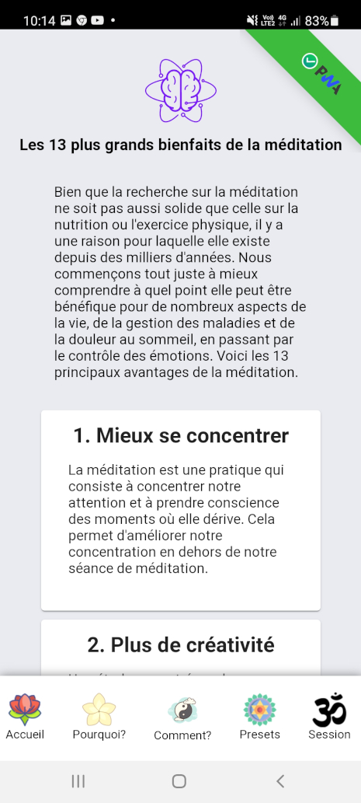
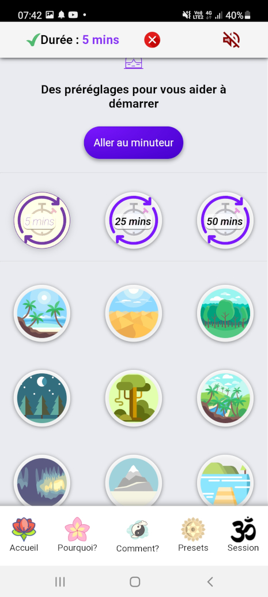
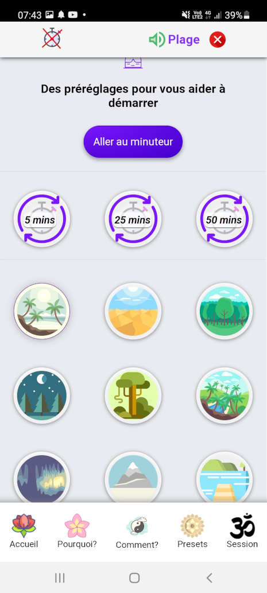
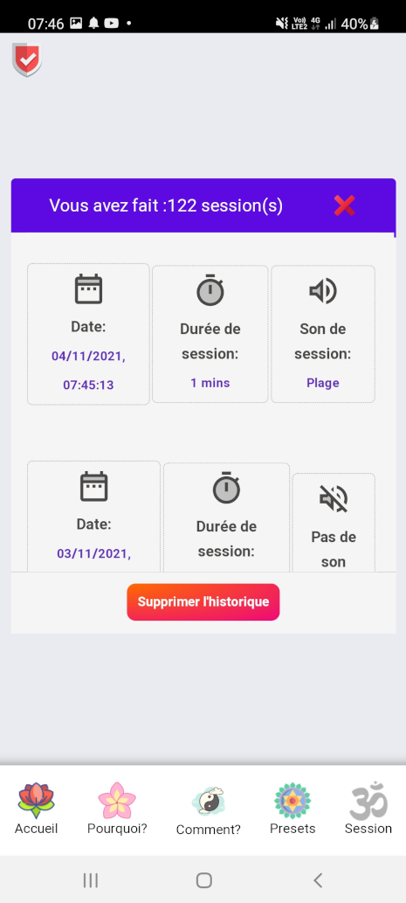

# Guide d'utilisation - Version Française - 🇫🇷

🇬🇧 - For the english version, click [HERE ](./README_US.md)

---

## My Meditation Time_V1.3.0

Une Application d'initiation et de pratique de la méditation simple et intuitive, pour adultes et enfants.

### :bookmark: Avec cette application vous pouvez méditer en toute simplicité, il y a différents préréglages (durée ou/et son d'ambiance) disponibles.

## Quick Links

[Application en ligne](#computer-site-en-ligne)

[Apperçu de l'App](#apperçu-de-lapp)

  - [Téléphone Portable](#téléphone-portable)
  - [Tablette](#tablette)
  - [Ordinateurs](#ordinateurs)
    - [Windows](#windows)
    - [Mac](#mac)
    - [Linux](#linux)

[Installer l'application](#installer-lapplication)

[Menu Pour un accès rapide](#menu-pour-un-accès-rapide)

[Plusieurs Niveaux](#plusieurs-niveaux)

  - [Débutant](#débutant)

  - [Intermédiaire](#intermédiaire)

  - [Confirmé](#confirmé)

  - [Expert](#expert)

[Fonctionnalités](#fonctionnalités)

  - [Pourquoi ?](#pourquoi-)

  - [Comment ?](#comment-)

  - [Les préréglages](#les-préréglages)

  - [La session](#la-session)

  - [historique des sessions](#historique-des-sessions)

  - [Supprimer l'historique](#supprimer-lhistorique)

  - [Partagez l'application avec vos ami(e)s](#partagez-lapplication-avec-vos-amies)

[Désinstaller l'application](#désinstaller-lapplication)

[compatibilité](#compatibilités)

[Auteur](#bust_in_silhouette-auteur)

[Un mot de l'auteur](#large_blue_diamond-un-mot-de-lauteur)

[Soutenir le projet](#sparkling_heart-soutenir-le-projet)

[Licence](#scroll-licence)

[Mes autres projets](#mes-autres-projets)

---

# :computer: site en ligne

**Vous pouvez utiliser l'application My Meditation Time GRATUITEMENT** **[ICI](https://my-meditation-time.netlify.app/)**,

---

# Apperçu de l'App.

>**:heavy_check_mark: C'est une Progressive Web App (PWA)**

## Téléphone Portable:

>

## Tablette:

>

## Ordinateurs:

### Windows:

>

### Mac:

>

### Linux:

**(Ubuntu dans cette exemple)**

>

---

# Installer l'application!

:heavy_check_mark: Vous pouvez installer simplement l'application sur tous téléphones portables ou ordinateurs Windows, Mac ou Linux.

>

>Cliquez sur le bandeau qui apparaît en bas de votre écran de téléphone!
Ce message vous invite à installer l'application.

---
### une fois ceci fait!

>

>Une fenêtre apparaît... cliquez sur installer!
>
>Cette action va installer le package de l'application en passant par le store (playStore pour android par exemple)

>Un message apparaît afin de vous informez que l'installation est en cours :heavy_check_mark:
>
>

### Voilà, l'application est installée sur votre téléphone

>

## Menu Pour un accès rapide.

>

---

# Plusieurs Niveaux.

>***Il y a 4 niveaux dans l'application***
>
>Chaque niveau fait légèrement varier l'apparence de l'application et fait apparaître des sons supplémentaires dans la section préréglages!

>

**Cette fenêtre est accessible en cliquant sur le badge, en haut à gauche sur votre écran (il faut avoir fait au moins une session pour avoir le badge débutant)**

---

## Apparence selon le niveau:

### Débutant

>**La couleur bleue pour le niveau Débutant!**

>
---

**:heavy_check_mark: 15 Sons environnementaux sont disponibles, comme par exemple, la plage, le désert, la forêt, etc...**

>

>:heavy_exclamation_mark: Tous ces sons sont parfaits pour travailler la concentration, la visualisation et la respiration... Les trois piliers de votre apprentissage pour les débutants, ou une belle promenade mentale pour les plus initiés !

---

>**La fenêtre qui vous informent du changement de niveau**

>

### Intermédiaire

>**La couleur violet pour le niveau Intermédiaire!**

>

---

**:heavy_check_mark: 9 mantras musicaux en sanskrit sont ajoutés, comme par exemple, om namah shivaya, dhyan mantra, harekrishna flûte, etc...**

>

>:heavy_exclamation_mark: Les mantras sont bien connus pour avoir des vertus pour le corps et l'esprit !

---

>**La fenêtre qui vous informent du changement de niveau**

>

### Confirmé

>**La couleur rouge pour le niveau Confirmé!**

>

---

**:heavy_check_mark: 9 Sons alignés sur une fréquence sont ajoutés, comme par exemple, 174Hz, 285Hz, 396Hz, etc...**

>

>:heavy_exclamation_mark: Toutes ces mélodies ont des vertus pour le corps et l'esprit (chaque vertu est affichée dans une bulle d'information lorsque vous cliquez sur un son)

---

>**La fenêtre qui vous informent du changement de niveau**

>

#### Expert

>**La couleur noir pour le niveau Expert!**

>

---

**:heavy_check_mark: 9 nouveaux Sons alignés sur une fréquence sont ajoutés, comme par exemple, 714Hz, 852Hz, 963Hz, etc...**
>:heavy_exclamation_mark: Toutes ces mélodies ont des vertus pour le corps et l'esprit (chaque vertu est affichée dans une bulle d'information lorsque vous cliquez sur un son)

---

# Fonctionnalités

## Pourquoi ?

**:heavy_exclamation_mark: Dans cette section vous trouverez quelques bienfaits de la méditation:**

>13 bienfaits sont enumérés, afin de mieux comprendre ce que fait la méditation sur le corps et l'esprit.

---

## Comment ?

**:heavy_exclamation_mark:  Dans cette section vous trouverez quelques conseils pour bien pratiquez la méditation:**

>8 conseils pratiques sont présentés ici, afin de vous faciliter la pratique au quotidien.

---

## Les préréglages

**:heavy_exclamation_mark: Dans cette section nous allons voir les différents préréglages présents**

>Vous pouvez selectionner une durée prédéfinie puis cliquez sur le bouton "aller au minuteur".

>Ou bien, vous pouvez selectionner un son pour vous accompagner durant votre méditation, puis cliquez sur le bouton "aller au minuteur".

>Ou encore, selectionner un son et une durée prédéfinie, puis cliquez sur le bouton "aller au minuteur".

---

## La session

**:heavy_exclamation_mark: Time Tracker : C'est le compteur temps de l'application**

>Vous pouvez directement entrer la durée perso que vous souhaitez, vous n'aurez pas de possibilité de définir un son par ce biais.

>***:heavy_exclamation_mark:Lorsque vous entrez un chiffre, un retentissement de bol tibétain se fait entendre, cela signifie que l'app est prête pour votre séance.***

>Si vous souhaitez définir un son, passez par la section préréglages, ne selectionnez que le son, pas de durée, puis cliquez sur le bouton "Aller au miniteur". Vous pourrez définir la durée que vous souhaitez ensuite (12 mins dans cet exemple).

>Ainsi, lorsque vous démarrez le timer, vous aurez une durée et un son affiché sur votre écran ("12 mins" et j'ai choisi, au préalable,"forêt" dans cet exemple).

>***:heavy_exclamation_mark: Lorsque le timer s'arrête, de nouveau un retentissement de bol tibétain se fait entendre, cela signifie que c'est la fin de votre session.***

---

## Historique des sessions

**:heavy_exclamation_mark: Historique des sessions**

>Une fois votre première séance de méditation effectuée, vous avez un bouton "historique" qui apparaît à l'écran. (il faut au moins une séance pour que le bouton soit apparent)

>En cliquant sur ce bouton, vous verrez l'historique de toutes vos séances, ordonnées de la plus récente à la plus ancienne.

---

## Supprimer l'historique.

**:heavy_exclamation_mark: Vous pouvez à tout moment supprimer votre historique simplement**

>Cliquez sur le bouton rouge présent sur la fenêtre... attention, cette action est irréversible, vous ne pourrez pas revenir en arrière!

## Partagez l'application avec vos ami(e)s

**Vous pouvez rapidement et facilement partager cette application, voici comment faire !**

> Cliquez sur le bouton "i" en bas à droite de votre écran...
> puis cliquez sur l'icone "partager"!

> Cela fera apparaître un QrCode, qu'il suffit de scanner pour se rendre à l'adresse de l'application web.

---

## Désinstaller l'application!

**:heavy_exclamation_mark: Vous pouvez désinstaller cette App quand vous le souhaitez, simplement**

>laissez votre doigt sur l'icone de l'app une seconde environ, elle se met à danser et un menu contextuel apparaît. cliquez sur Désinst.

>

>Une fenêtre vous demande alors, si vous souhaitez vraiment supprimer cette application. cliquez sur ok.

>Une fois ceci fait, un ultime message apparaîtra afin de vous prévenir que l'app à bien été désinstallé.

---

# compatibilités

Compatibilité de l'app avec les navigateurs/téléphones:

# :bust_in_silhouette: Auteur

- Pensé, conçu et développé avec :purple_heart: par Rodolphe Augusto

---

# :large_blue_diamond: Un mot de l'auteur

Enjoy the World :smirk:

---

# :sparkling_heart: Soutenir le projet

Je mets presque tout ce que je peux en open-source, et j'essaie de satisfaire toute personne qui a besoin d'aide pour utiliser ces projets. Évidemment, cela prend du temps. Vous pouvez utiliser ce service gratuitement.

Toutefois, si vous utilisez ce projet et que vous en êtes satisfaits ou si vous voulez simplement m'encourager à continuer à créer : -.

- Partagez l'application et parlez en autour de vous :rocket:

Thank you! :heart:

---

# :scroll: Licence

MIT

---

# Mes autres projets:

>### My Simple Tutorial Creator
>[https://github.com/rodolphe37/my-simple-tutorial-creator](https://github.com/rodolphe37/my-simple-tutorial-creator)

>### My Simple Cam
>[https://github.com/rodolphe37/my-simple-cam-dektop-app](https://github.com/rodolphe37/my-simple-cam-dektop-app)

>### My SimpleTasks Manager (PWA version)
[https://github.com/rodolphe37/my-simple-tasks-manager-](https://github.com/rodolphe37/my-simple-tasks-manager-)

>### My SimpleTasks Manager (software version for Linux, Mac & Windows)
>[https://github.com/rodolphe37/my-simple-tasks-manager-desktop-version](https://github.com/rodolphe37/my-simple-tasks-manager-desktop-version)

>### QRCode Tools
>[https://github.com/rodolphe37/qr-code-tools](https://github.com/rodolphe37/qr-code-tools)

>### App for decrypt greenPass europe QRcode
>[https://github.com/rodolphe37/qrcode-decoder](https://github.com/rodolphe37/qrcode-decoder)

>### Css animation with Create React App base.
>[https://github.com/rodolphe37/halloween2021-bat-tuto-youtube-video](https://github.com/rodolphe37/halloween2021-bat-tuto-youtube-video)

>### My GitHub "open Sources" project
>[https://github.com/rodolphe37/pwa-react-project](https://github.com/rodolphe37/pwa-react-project)

>### cra-template-github-my-profile
>[https://github.com/rodolphe37/cra-template-github-my-profile](https://github.com/rodolphe37/cra-template-github-my-profile)

>### My Awesome Custom Alert
>[https://github.com/rodolphe37/my-awesome-custom-alert](https://github.com/rodolphe37/my-awesome-custom-alert)

>### Geolocation starter app React-native
>[https://github.com/rodolphe37/react-native_geolocation-tracker](https://github.com/rodolphe37/react-native_geolocation-tracker)

>### Classic React Ultimate Messenger version repository (for open sources contributors)
>[https://github.com/rodolphe37/rum-open-sources](https://github.com/rodolphe37/rum-open-sources)

>### React Ultimate Messenger template for React (create-react-app tools)
>[https://github.com/rodolphe37/cra-react-ultimate-messenger](https://github.com/rodolphe37/cra-react-ultimate-messenger)

>### PWA React Ultimate Messenger template for React (create-react-app tools)
>[https://github.com/rodolphe37/cra-pwa-react-ultimate-messenger](https://github.com/rodolphe37/cra-pwa-react-ultimate-messenger)

>### installation and initialization shell script for the PWA React Ultimate Messenger template
>[https://github.com/rodolphe37/pwa-rum-install-pack](https://github.com/rodolphe37/pwa-rum-install-pack)

>### Upload-image-profil-component
>[https://github.com/rodolphe37/Upload-image-profil-component](https://github.com/rodolphe37/Upload-image-profil-component)

>### Jeux libres de droits "open Sources" - Memory Yoga Cards Game - Sort the Waste Game - Match 3 Yoga Game - Tetris Classic Game - Remake Earth Puzzle Game
>[https://github.com/rodolphe37/install-games-repository](https://github.com/rodolphe37/install-games-repository)

>### Administration template - React JS & react-admin
>[https://github.com/rodolphe37/nfc-updates-front](https://github.com/rodolphe37/nfc-updates-front)

>### Administration template Backend - Node & Express
>[https://github.com/rodolphe37/nfc-updates-back](https://github.com/rodolphe37/nfc-updates-back)

---
