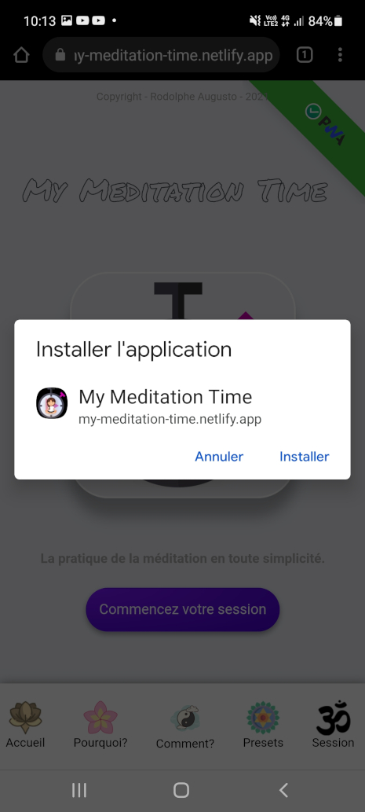
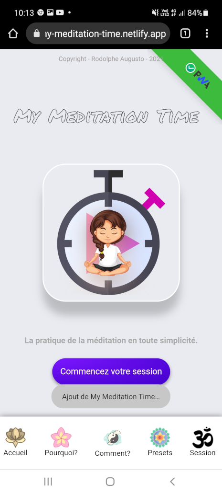
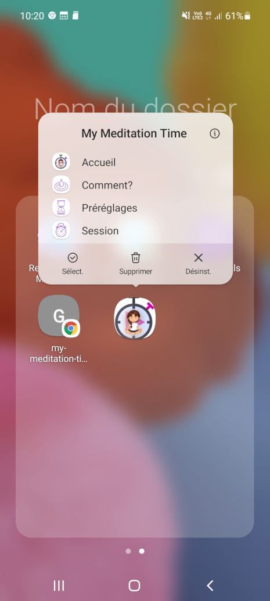
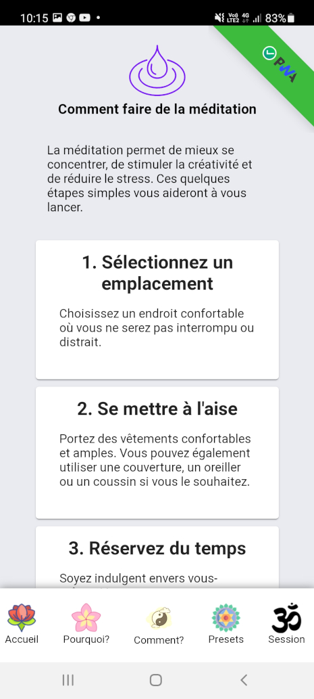
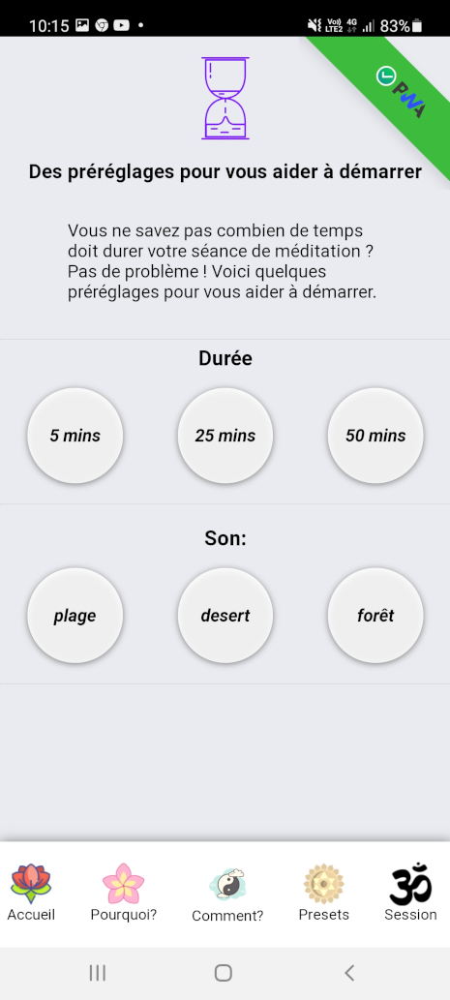
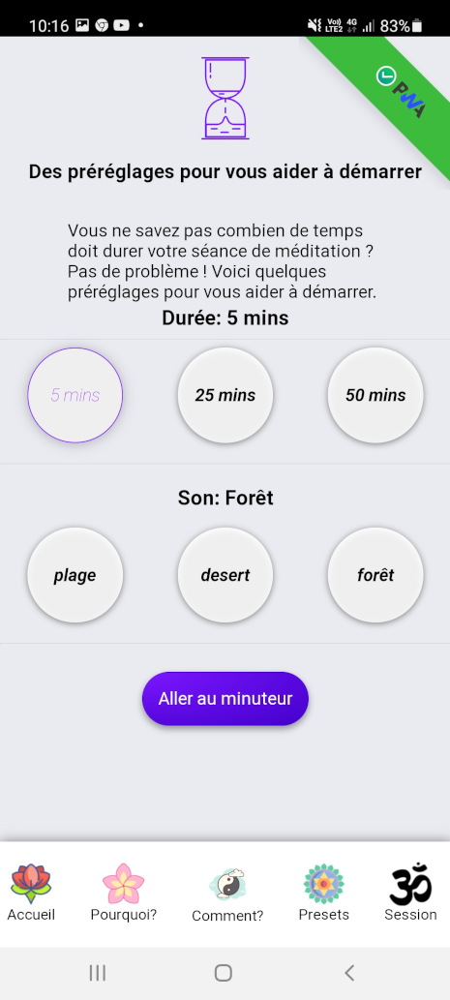
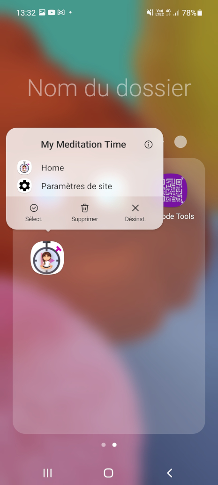
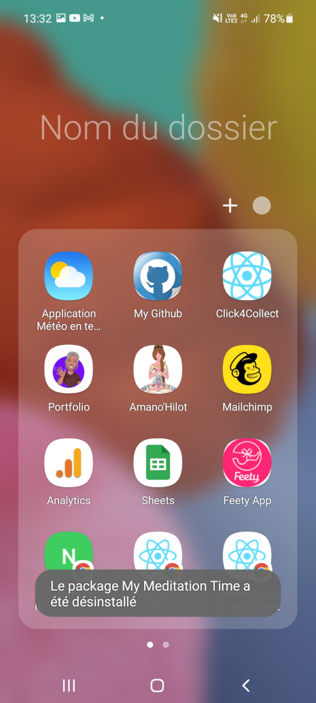
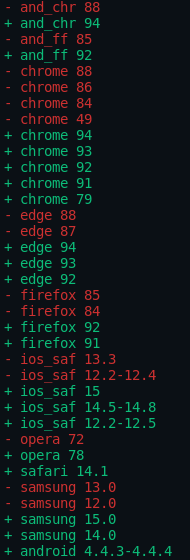

# User guide - English version - 🇬🇧

🇫🇷 - Pour la version Française, cliquez [ICI](./README.md)

---

## My Meditation Time_V1.0.0

A simple and intuitive meditation initiation and practice application for adults and children.

### :bookmark: With this application you can meditate in all simplicity, there are different presets (duration or/and ambient sound) available.

## Quick Links

[Online application](#computer-site-en-ligne)

[App Overview](#apperçu-de-lapp)

  - [Mobile phone](#téléphone-portable)
  - [Tablet]()
  - [Computers]()
    - [Windows](#windows)
    - [Mac](#mac)
    - [Linux](#linux)

[Install the application](#installer-lapplication)

[Menu For quick access](#menu-pour-un-accès-rapide)

[Features](#fonctionnalités)

  - [Why?](#pourquoi-)

  - [How?](#comment-)

  - [The presets](#les-préréglages)

  - [The session](#la-session)

  - [session history](#historique-des-sessions)

  - [Delete history](#supprimer-lhistorique)

[Uninstall the application](#désinstaller-lapplication)

[compatibility](#compatibilités)

[Author](#bust_in_silhouette-auteur)

[A word from the author](#large_blue_diamond-un-mot-de-lauteur)

[Support the project](#sparkling_heart-soutenir-le-projet)

[License](#scroll-licence)

[My other projects](#mes-autres-projets)

---

# :computer: online site

**You can use the My Meditation Time application for FREE** **[HERE](https://my-meditation-time-us-version.netlify.app/)**,

---

# Overview of the App.

>**:heavy_check_mark: It is a Progressive Web App (PWA)**

## Mobile phone:

>

## Tablet:

>

## Computers:

### Windows:

>

### Mac:

>

### Linux:

**(Ubuntu in this example)**

>

---

# Install the application!

:heavy_check_mark: You can simply install the application on any Windows, Mac or Linux mobile phone or computer.

>

>Click on the banner that appears at the bottom of your phone screen!
This message prompts you to install the application.

---
### une fois ceci fait!

>

>A window appears... click on install!
>
>This action will install the application package through the store (playStore for android for example)

>A message appears to inform you that the installation is in progress :heavy_check_mark:
>
>

### The application is now installed on your phone

>

## Menu For quick access.

>

---

# Features

## Why?

**:heavy_exclamation_mark: In this section you will find some benefits of meditation:**

>13 benefits are listed, to better understand what meditation does to the body and mind.

---

## Comment ?

**:heavy_exclamation_mark:  In this section you will find some tips on how to practice meditation:**

>8 practical tips are presented here, in order to facilitate your daily practice.

---

## Les préréglages

**:heavy_exclamation_mark: Dans cette section nous allons voir les différents préréglages présents**

>Vous pouvez selectionner une durée prédéfinie puis cliquez sur le bouton "aller au minuteur".

>Ou bien, vous pouvez selectionner un son pour vous accompagner durant votre méditation, puis cliquez sur le bouton "aller au minuteur".

>Ou encore, selectionner un son et une durée prédéfinie, puis cliquez sur le bouton "aller au minuteur".

---

## La session

**:heavy_exclamation_mark: Time Tracker : C'est le compteur temps de l'application**

>Vous pouvez directement entrer la durée perso que vous souhaitez, vous n'aurez pas de possibilité de définir un son par ce biais.

>***:heavy_exclamation_mark:Lorsque vous entrez un chiffre, un retentissement de bol tibetain se fait entendre, cela signifie que l'app est prête pour votre séance.***

>Si vous souhaitez définir un son, passez par la section préréglages, ne selectionnez que le son, pas de durée, puis cliquez sur le bouton. Vous pourrez définir la durée que vous souhaitez ensuite (5 mins dans cet exemple).

>Ainsi, lorsque vous démarrez le timer, vous aurez une durée et un son affiché sur votre écran ("5 mins" et "forêt" dans cet exemple).

>***:heavy_exclamation_mark: Lorsque le timer s'arrête, deux retentissements de bol tibetain se font entendre, cela signifie que c'est la fin de votre session.***

---

## Historique des sessions

**:heavy_exclamation_mark: Historique des sessions**

>Une fois votre première séance de méditation effectuée, vous avez un bouton "historique" qui apparaît à l'écran. (il faut au moins une séance pour que le bouton soit apparent)

>En cliquant sur ce bouton, vous verrez l'historique de toutes vos séances, ordonnées de la plus récente à la plus ancienne (dans cet exemple, il y a trois sessions mais il n'y a pas de limite).

---

## Supprimer l'historique.

**:heavy_exclamation_mark: Vous pouvez à tout moment supprimer votre historique simplement**

>Cliquez sur le bouton rouge présent sur la fenêtre... attention, cette action est irréversible, vous ne pourrez pas revenir en arrière!

---

## Désinstaller l'application!

**:heavy_exclamation_mark: Vous pouvez désinstaller cette App quand vous le souhaitez, simplement**

>laissez votre doigt sur l'icone de l'app une seconde environ, elle se met à danser et un menu contextuel apparaît. cliquez sur Désinst.

>Une fenêtre vous demande alors, si vous souhaitez vraiment supprimer cette application. cliquez sur ok.

>Une fois ceci fait, un ultime message apparaîtra afin de vous prévenir que l'app à bien été désinstallé.

---

# compatibilités

Compatibilité de l'app avec les navigateurs/téléphones:

# :bust_in_silhouette: Auteur

- Pensé, conçu et développé avec :purple_heart: par Rodolphe Augusto

---

# :large_blue_diamond: Un mot de l'auteur

Enjoy the World :smirk:

---

# :sparkling_heart: Soutenir le projet

Je mets presque tout ce que je peux en open-source, et j'essaie de satisfaire toute personne qui a besoin d'aide pour utiliser ces projets. Évidemment, cela prend du temps. Vous pouvez utiliser ce service gratuitement.

Toutefois, si vous utilisez ce projet et que vous en êtes satisfaits ou si vous voulez simplement m'encourager à continuer à créer : -.

- Partagez l'application et parlez en autour de vous :rocket:

Thank you! :heart:

---

# :scroll: Licence

MIT

---

# Mes autres projets:

>### My Simple Tutorial Creator
>https://github.com/rodolphe37/my-simple-tutorial-creator

>### My Simple Cam
>https://github.com/rodolphe37/my-simple-cam-dektop-app

>### My SimpleTasks Manager (software version for Linux, Mac & Windows)
>https://github.com/rodolphe37/my-simple-tasks-manager-desktop-version

>### QRCode Tools
>https://github.com/rodolphe37/qr-code-tools

>### App for decrypt greenPass europe QRcode
>https://github.com/rodolphe37/qrcode-decoder

>### Css animation with Create React App base.
>https://github.com/rodolphe37/halloween2021-bat-tuto-youtube-video

>### My GitHub "open Sources" project
>https://github.com/rodolphe37/pwa-react-project

>### cra-template-github-my-profile
>https://github.com/rodolphe37/cra-template-github-my-profile

>### My Awesome Custom Alert
>https://github.com/rodolphe37/my-awesome-custom-alert

>### Geolocation starter app React-native
>https://github.com/rodolphe37/react-native_geolocation-tracker

>### Classic React Ultimate Messenger version repository (for open sources contributors)
>https://github.com/rodolphe37/rum-open-sources

>### React Ultimate Messenger template for React (create-react-app tools)
>https://github.com/rodolphe37/cra-react-ultimate-messenger

>### PWA React Ultimate Messenger template for React (create-react-app tools)
>https://github.com/rodolphe37/cra-pwa-react-ultimate-messenger

>### installation and initialization shell script for the PWA React Ultimate Messenger template
>https://github.com/rodolphe37/pwa-rum-install-pack

>### Upload-image-profil-component
>https://github.com/rodolphe37/Upload-image-profil-component

>### Jeux libres de droits "open Sources" - Memory Yoga Cards Game - Sort the Waste Game - Match 3 Yoga Game - Tetris Classic Game - Remake Earth Puzzle Game
>https://github.com/rodolphe37/install-games-repository

>### Administration template - React JS & react-admin
>https://github.com/rodolphe37/nfc-updates-front

>### Administration template Backend - Node & Express
>https://github.com/rodolphe37/nfc-updates-back

---
