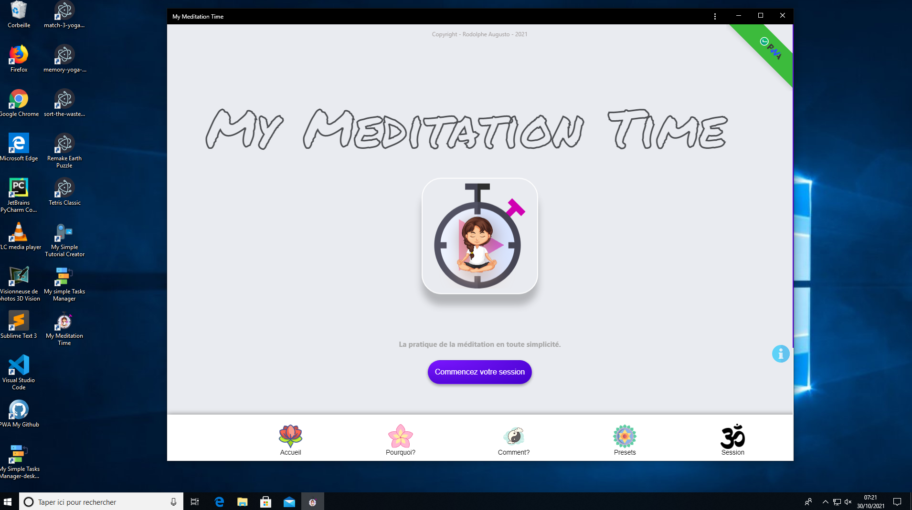
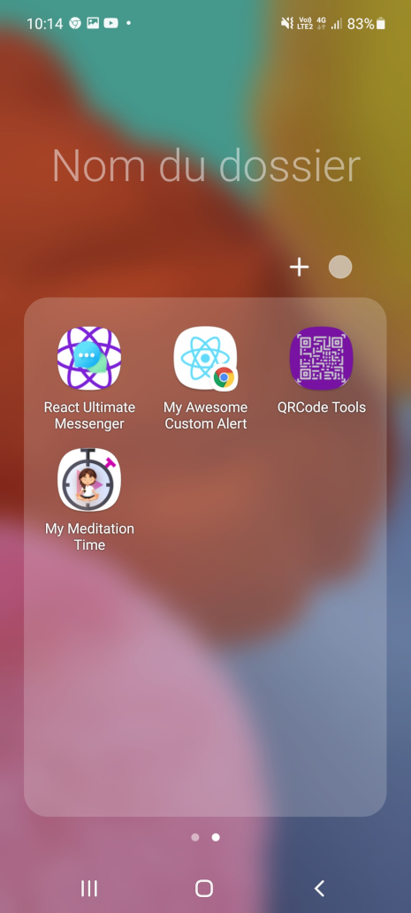
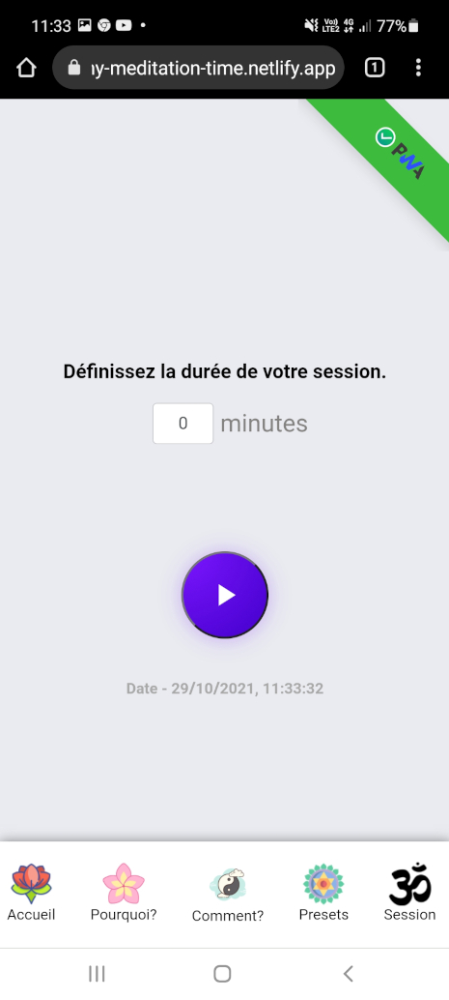
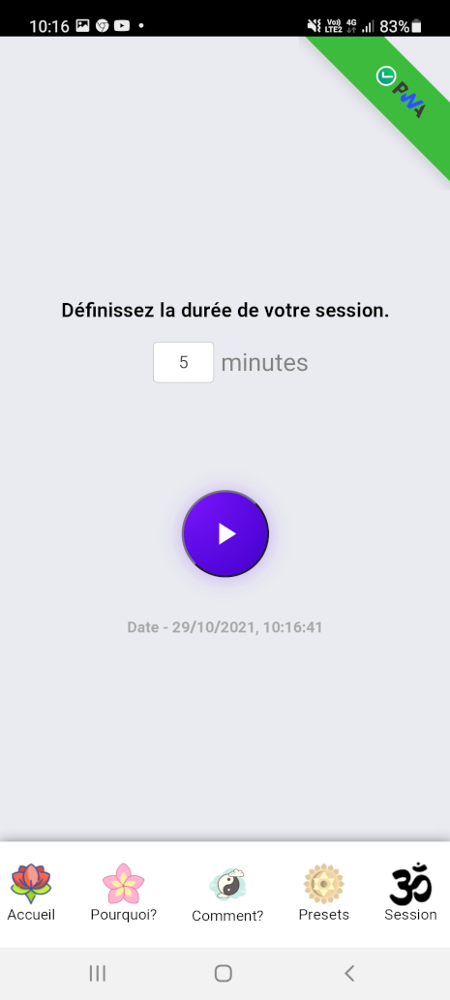
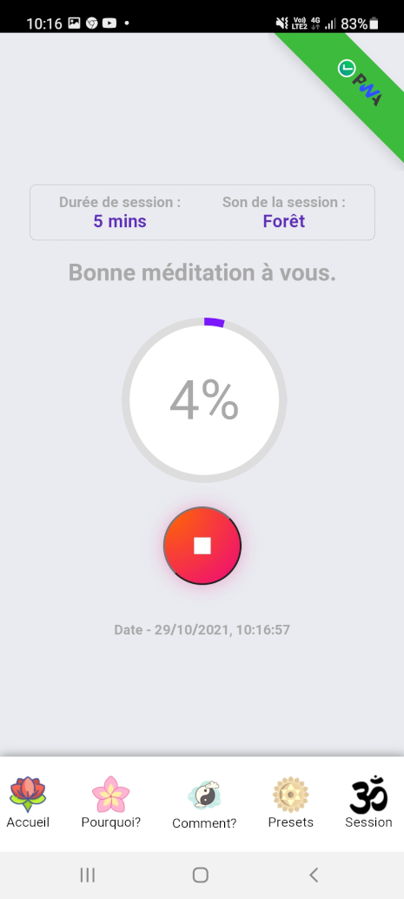
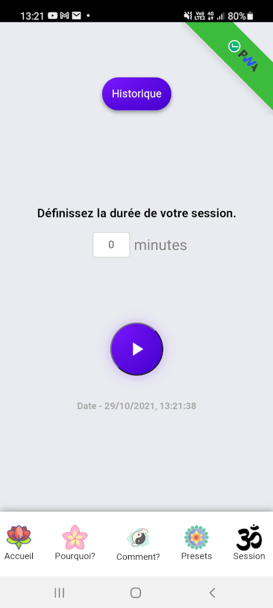

# User guide - English version.

<figure class="{{index .Params 1}}">
  <svg
                width="35px"
                height="35px"
                xmlns="http://www.w3.org/2000/svg"
                id="svg2"
                viewBox="0 0 768 768"
                version="1.1"
              >
                <defs id="defs4">
                  <clipPath id="clipPathFlag" clipPathUnits="userSpaceOnUse">
                    <rect
                      id="rect3918"
                      fill-opacity=".67"
                      ry="57"
                      height="511"
                      width="511"
                      y=".5"
                      x=".5"
                    />
                  </clipPath>
                  <linearGradient id="linearGradient3852-0">
                    <stop id="stop3854-6" stop-color="#dbe3db" offset="0" />
                    <stop
                      id="stop3856-1"
                      stop-color="#dbe3db"
                      stop-opacity="0"
                      offset="1"
                    />
                  </linearGradient>
                  <linearGradient
                    id="linearGradient5122"
                    x1="342.19"
                    gradientUnits="userSpaceOnUse"
                    y1="705.76"
                    gradientTransform="matrix(1.1571 0 0 1.3167 -91.204 -253.99)"
                    x2="358.08"
                    y2="523.41"
                  />
                  <linearGradient
                    id="linearGradient5125"
                    x1="405.26"
                    gradientUnits="userSpaceOnUse"
                    y1="118.06"
                    gradientTransform="matrix(.95303 0 0 .86647 11.575 -4.5016)"
                    x2="405.75"
                    y2="360.92"
                  />
                  <filter id="filter5740">
                    <feGaussianBlur
                      id="feGaussianBlur5742"
                      stdDeviation="5.12"
                    />
                  </filter>
                  <clipPath id="clipPath5796" clipPathUnits="userSpaceOnUse">
                    <rect
                      id="rect5798"
                      ry="57"
                      height="512"
                      width="512"
                      stroke="#00fa00"
                      y="0"
                      x="0"
                      stroke-width="20"
                      fill="none"
                    />
                  </clipPath>
                  <filter id="filter5912">
                    <feGaussianBlur
                      id="feGaussianBlur5914"
                      stdDeviation="17.92"
                    />
                  </filter>
                </defs>
                <g id="template-button">
                  &gt;
                  <g id="00" transform="translate(90,90)">
                    <rect
                      id="shadow"
                      ry="57"
                      height="512"
                      filter="url(#filter5912)"
                      width="512"
                      stroke="#a8a8a8"
                      y="56"
                      x="38"
                      stroke-width="5"
                    />
                  </g>
                  <g
                    id="01"
                    transform="translate(128,128)"
                    clip-path="url(#clipPathFlag)"
                  >
                    <rect
                      id="mask"
                      ry="57"
                      height="512"
                      width="512"
                      y="0"
                      x="0"
                      fill="#00f"
                    />
                    <g
                      id="flag"
                      transform="matrix(1.024 0 0 1.024 -256 -.0000024)"
                      clip-path="url(#clipPath3224)"
                    >
                      <g id="g578" transform="scale(16.667)">
                        <rect
                          id="rect124"
                          height="30"
                          width="60"
                          y="0"
                          x="0"
                          stroke-width="1pt"
                          fill="#006"
                        />
                        <g id="g584">
                          <path
                            id="path146"
                            stroke-width="1pt"
                            fill="#fff"
                            d="m0 0v3.3541l53.292 26.646h6.708v-3.354l-53.292-26.646h-6.708zm60 0v3.354l-53.292 26.646h-6.708v-3.354l53.292-26.646h6.708z"
                          />
                          <path
                            id="path136"
                            stroke-width="1pt"
                            fill="#fff"
                            d="m25 0v30h10v-30h-10zm-25 10v10h60v-10h-60z"
                          />
                          <path
                            id="path141"
                            stroke-width="1pt"
                            fill="#c00"
                            d="m0 12v6h60v-6h-60zm27-12v30h6v-30h-6z"
                          />
                          <path
                            id="path150"
                            stroke-width="1pt"
                            fill="#c00"
                            d="m0 30 20-10h4.472l-20 10h-4.472zm0-30 20 10h-4.472l-15.528-7.7639v-2.2361zm35.528 10 20-10h4.472l-20 10h-4.472zm24.472 20-20-10h4.472l15.528 7.764v2.236z"
                          />
                        </g>
                      </g>
                    </g>
                  </g>
                  <g id="02" transform="translate(0,38)">
                    <path
                      id="path3862-8"
                      style={{ color: "#000000" }}
                      fill="url(#linearGradient5125)"
                      d="m214.21 111.21c-45.245 0.18809-68.716 7.7308-64.094 83.553l2.8252 46.345c47.474 5.5124 56.664 18.445 104.36 21.914 68.073 4.9513 67.937 5.4209 130.56-14.384 62.628-19.805 5.8248-65.247 207.32-57.82 4.6033 0.16968 17.314-3.0527 27.462-12.15 5.5817-46.524-2.7842-69.143-66.934-68.876z"
                    />
                    <path
                      id="path3079-9"
                      style={{ color: "#000000" }}
                      fill="url(#linearGradient5122)"
                      d="m531.03 495.17c-31.605 19.022-27.601 31.26-37.913 32.573-94.704 12.053-145.98-0.72701-165.8-12.061-59.588-34.078-68.468-13.014-100.22-16.574-20.115-2.2551-59.245 12.984-73.388 44.344 3.4722 27.608 18.111 32.098 44.281 31.986l356.06-1.5268c69.692-0.29885 56.335-8.4926 65.543-56.039-14.772-21.671-13.157 9.109-44.224-30.717z"
                    />
                    <rect
                      id="rect5734"
                      transform="translate(128,90)"
                      clip-path="url(#clipPath5796)"
                      ry="57"
                      height="512"
                      filter="url(#filter5740)"
                      width="512"
                      stroke="#000"
                      y="0"
                      x="0"
                      stroke-width="20"
                      fill="none"
                    />
                  </g>
                </g>
              </svg>
</figure>

Pour la version Française, cliquez [ICI](./README.md)

---

## My Meditation Time_V1.0.0

Une Application d'initiation et de pratique de la méditation simple et intuitive, pour adultes et enfants.

### :bookmark: Avec cette application vous pouvez méditer en toute simplicité, il y a différents préréglages (durée ou/et son d'ambiance) disponibles.

## Quick Links

[Application en ligne](#computer-site-en-ligne)

[Apperçu de l'App](#apperçu-de-lapp)

  - [Téléphone Portable](#téléphone-portable)
  - [Tablette]()
  - [Ordinateurs]()
    - [Windows](#windows)
    - [Mac](#mac)
    - [Linux](#linux)

[Installer l'application](#installer-lapplication)

[Menu Pour un accès rapide](#menu-pour-un-accès-rapide)

[Fonctionnalités](#fonctionnalités)

  - [Pourquoi ?](#pourquoi-)

  - [Comment ?](#comment-)

  - [Les préréglages](#les-préréglages)

  - [La session](#la-session)

  - [historique des sessions](#historique-des-sessions)

  - [Supprimer l'historique](#supprimer-lhistorique)

[Désinstaller l'application](#désinstaller-lapplication)

[compatibilité](#compatibilités)

[Auteur](#bust_in_silhouette-auteur)

[Un mot de l'auteur](#large_blue_diamond-un-mot-de-lauteur)

[Soutenir le projet](#sparkling_heart-soutenir-le-projet)

[Licence](#scroll-licence)

[Mes autres projets](#mes-autres-projets)

---

# :computer: site en ligne

**Vous pouvez utiliser l'application My Meditation Time GRATUITEMENT** **[ICI](https://my-meditation-time.netlify.app/)**,

---

# Apperçu de l'App.

>**:heavy_check_mark: C'est une Progressive Web App (PWA)**

## Téléphone Portable:

>

## Tablette:

>

## Ordinateurs:

### Windows:

>

### Mac:

>

### Linux:

**(Ubuntu dans cette exemple)**

>

---

# Installer l'application!

:heavy_check_mark: Vous pouvez installer simplement l'application sur tous téléphones portables ou ordinateurs Windows, Mac ou Linux.

>

>Cliquez sur le bandeau qui apparaît en bas de votre écran de téléphone!
Ce message vous invite à installer l'application.

---
### une fois ceci fait!

>

>Une fenêtre apparaît... cliquez sur installer!
>
>Cette action va installer le package de l'application en passant par le store (playStore pour android par exemple)

>Un message apparaît afin de vous informez que l'installation est en cours :heavy_check_mark:
>
>

### Voilà, l'application est installée sur votre téléphone

>

## Menu Pour un accès rapide.

>

---

# Fonctionnalités

## Pourquoi ?

**:heavy_exclamation_mark: Dans cette section vous trouverez quelques bienfaits de la méditation:**

>13 bienfaits sont enumérés, afin de mieux comprendre ce que fait la méditation sur le corps et l'esprit.

---

## Comment ?

**:heavy_exclamation_mark:  Dans cette section vous trouverez quelques conseils pour bien pratiquez la méditation:**

>8 conseils pratiques sont présentés ici, afin de vous faciliter la pratique au quotidien.

---

## Les préréglages

**:heavy_exclamation_mark: Dans cette section nous allons voir les différents préréglages présents**

>Vous pouvez selectionner une durée prédéfinie puis cliquez sur le bouton "aller au minuteur".

>Ou bien, vous pouvez selectionner un son pour vous accompagner durant votre méditation, puis cliquez sur le bouton "aller au minuteur".

>Ou encore, selectionner un son et une durée prédéfinie, puis cliquez sur le bouton "aller au minuteur".

---

## La session

**:heavy_exclamation_mark: Time Tracker : C'est le compteur temps de l'application**

>Vous pouvez directement entrer la durée perso que vous souhaitez, vous n'aurez pas de possibilité de définir un son par ce biais.

>***:heavy_exclamation_mark:Lorsque vous entrez un chiffre, un retentissement de bol tibetain se fait entendre, cela signifie que l'app est prête pour votre séance.***

>Si vous souhaitez définir un son, passez par la section préréglages, ne selectionnez que le son, pas de durée, puis cliquez sur le bouton. Vous pourrez définir la durée que vous souhaitez ensuite (5 mins dans cet exemple).

>Ainsi, lorsque vous démarrez le timer, vous aurez une durée et un son affiché sur votre écran ("5 mins" et "forêt" dans cet exemple).

>***:heavy_exclamation_mark: Lorsque le timer s'arrête, deux retentissements de bol tibetain se font entendre, cela signifie que c'est la fin de votre session.***

---

## Historique des sessions

**:heavy_exclamation_mark: Historique des sessions**

>Une fois votre première séance de méditation effectuée, vous avez un bouton "historique" qui apparaît à l'écran. (il faut au moins une séance pour que le bouton soit apparent)

>En cliquant sur ce bouton, vous verrez l'historique de toutes vos séances, ordonnées de la plus récente à la plus ancienne (dans cet exemple, il y a trois sessions mais il n'y a pas de limite).

---

## Supprimer l'historique.

**:heavy_exclamation_mark: Vous pouvez à tout moment supprimer votre historique simplement**

>Cliquez sur le bouton rouge présent sur la fenêtre... attention, cette action est irréversible, vous ne pourrez pas revenir en arrière!

---

## Désinstaller l'application!

**:heavy_exclamation_mark: Vous pouvez désinstaller cette App quand vous le souhaitez, simplement**

>laissez votre doigt sur l'icone de l'app une seconde environ, elle se met à danser et un menu contextuel apparaît. cliquez sur Désinst.

>Une fenêtre vous demande alors, si vous souhaitez vraiment supprimer cette application. cliquez sur ok.

>Une fois ceci fait, un ultime message apparaîtra afin de vous prévenir que l'app à bien été désinstallé.

---

# compatibilités

Compatibilité de l'app avec les navigateurs/téléphones:

# :bust_in_silhouette: Auteur

- Pensé, conçu et développé avec :purple_heart: par Rodolphe Augusto

---

# :large_blue_diamond: Un mot de l'auteur

Enjoy the World :smirk:

---

# :sparkling_heart: Soutenir le projet

Je mets presque tout ce que je peux en open-source, et j'essaie de satisfaire toute personne qui a besoin d'aide pour utiliser ces projets. Évidemment, cela prend du temps. Vous pouvez utiliser ce service gratuitement.

Toutefois, si vous utilisez ce projet et que vous en êtes satisfaits ou si vous voulez simplement m'encourager à continuer à créer : -.

- Partagez l'application et parlez en autour de vous :rocket:

Thank you! :heart:

---

# :scroll: Licence

MIT

---

# Mes autres projets:

>### My Simple Tutorial Creator
>https://github.com/rodolphe37/my-simple-tutorial-creator

>### My Simple Cam
>https://github.com/rodolphe37/my-simple-cam-dektop-app

>### My SimpleTasks Manager (software version for Linux, Mac & Windows)
>https://github.com/rodolphe37/my-simple-tasks-manager-desktop-version

>### QRCode Tools
>https://github.com/rodolphe37/qr-code-tools

>### App for decrypt greenPass europe QRcode
>https://github.com/rodolphe37/qrcode-decoder

>### Css animation with Create React App base.
>https://github.com/rodolphe37/halloween2021-bat-tuto-youtube-video

>### My GitHub "open Sources" project
>https://github.com/rodolphe37/pwa-react-project

>### cra-template-github-my-profile
>https://github.com/rodolphe37/cra-template-github-my-profile

>### My Awesome Custom Alert
>https://github.com/rodolphe37/my-awesome-custom-alert

>### Geolocation starter app React-native
>https://github.com/rodolphe37/react-native_geolocation-tracker

>### Classic React Ultimate Messenger version repository (for open sources contributors)
>https://github.com/rodolphe37/rum-open-sources

>### React Ultimate Messenger template for React (create-react-app tools)
>https://github.com/rodolphe37/cra-react-ultimate-messenger

>### PWA React Ultimate Messenger template for React (create-react-app tools)
>https://github.com/rodolphe37/cra-pwa-react-ultimate-messenger

>### installation and initialization shell script for the PWA React Ultimate Messenger template
>https://github.com/rodolphe37/pwa-rum-install-pack

>### Upload-image-profil-component
>https://github.com/rodolphe37/Upload-image-profil-component

>### Jeux libres de droits "open Sources" - Memory Yoga Cards Game - Sort the Waste Game - Match 3 Yoga Game - Tetris Classic Game - Remake Earth Puzzle Game
>https://github.com/rodolphe37/install-games-repository

>### Administration template - React JS & react-admin
>https://github.com/rodolphe37/nfc-updates-front

>### Administration template Backend - Node & Express
>https://github.com/rodolphe37/nfc-updates-back

---
