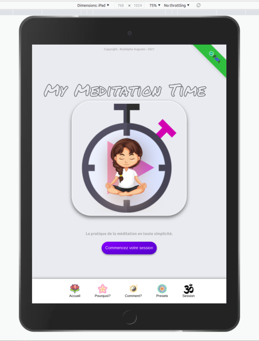
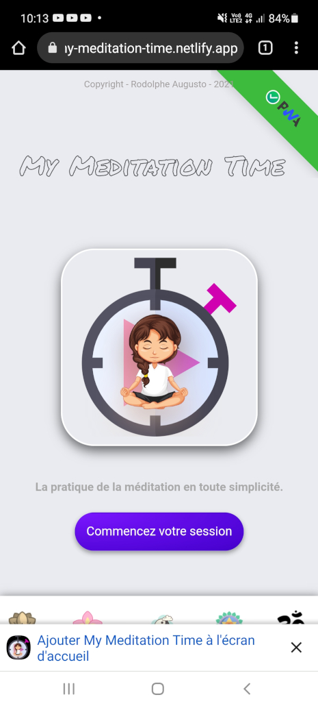
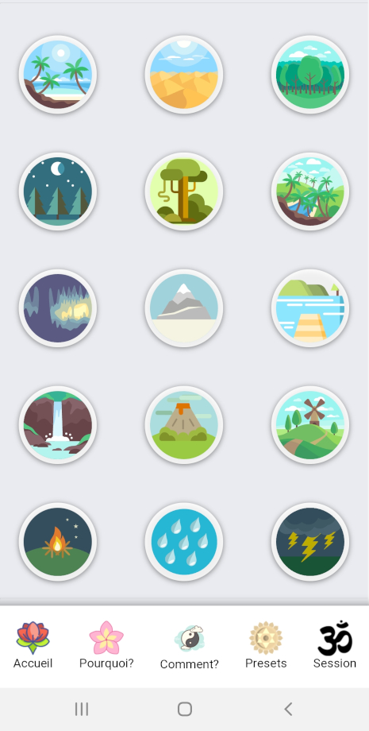
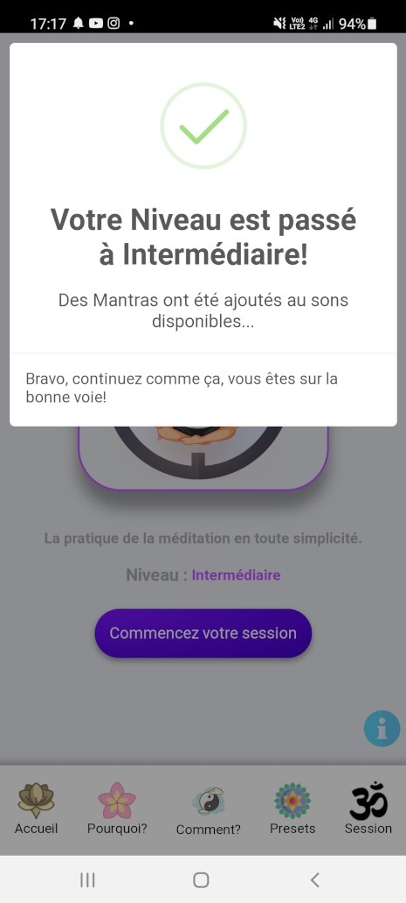
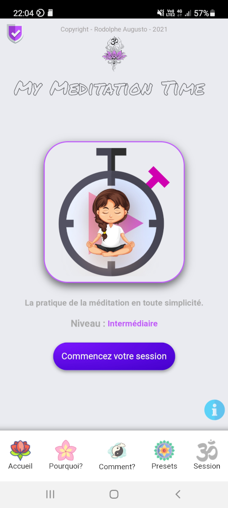
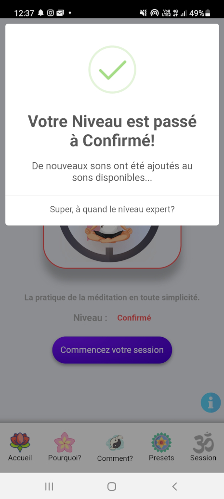
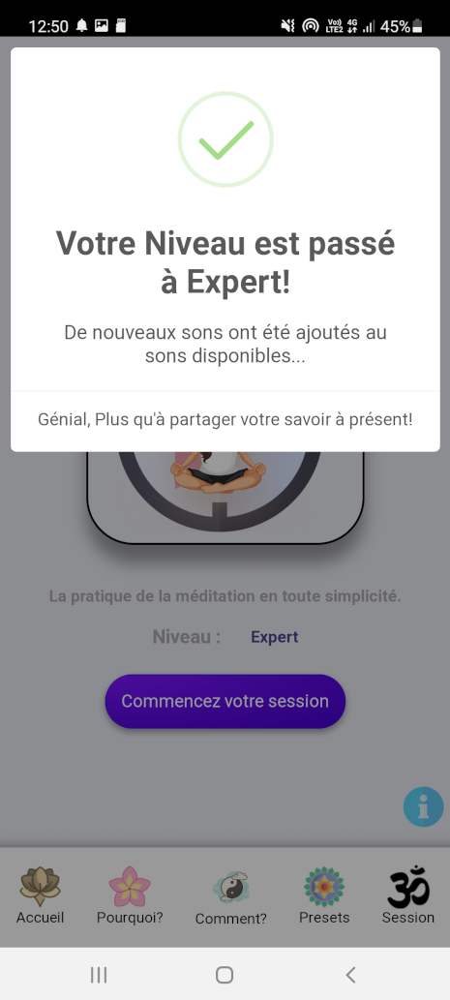

<head>
  <link rel="shortcut icon" type="image/x-icon" href="{{ site.baseurl }}/assets/favicon.ico" >
</head>

# User guide - English version - 🇬🇧

🇫🇷 - Pour la version Française, cliquez [ICI](./README.md)

>***Some screenshots are in French, but the application is entirely in English.***

---

## My Meditation Time_V1.3.0

A simple and intuitive meditation initiation and practice application for adults and children.

### :bookmark: With this application you can meditate in all simplicity, there are different presets (duration or/and ambient sound) available.

## Quick Links

[Online application](#computer-online-site)

[App Overview](#overview-of-the-app)

  - [Mobile phone](#mobile-phone)
  - [Tablet](#tablet)
  - [Computers](#computers)
    - [Windows](#windows)
    - [Mac](#mac)
    - [Linux](#linux)

[Install the application](#install-the-application)

[Menu For quick access](#menu-for-quick-access)

[Several levels](#several-levels)

  - [Beginner](#beginner)

  - [Intermediate](#intermediate)

  - [Advanced](#advanced)

  - [Expert](#expert)

[Features](#features)

  - [Why?](#why)

  - [How?](#how)

  - [The presets](#the-presets)

  - [The session](#the-presets)

  - [session history](#session-history)

  - [Delete history](#delete-history)

  - [Share the application with your friends](#share-the-application-with-your-friends)

[Uninstall the application](#uninstall-the-application)

[compatibility](#compatibilities)

[Author](#bust_in_silhouette-author)

[A word from the author](#large_blue_diamond-a-word-from-the-author)

[Support the project](#sparkling_heart-support-the-project)

[License](#scroll-licence)

[My other projects](#my-other-projects)

---

# :computer: online site

**You can use the My Meditation Time application for FREE** **[HERE](https://my-meditation-time-us-version.netlify.app/)**,

---

# Overview of the App.

>**:heavy_check_mark: It is a Progressive Web App (PWA)**

## Mobile phone:

>

## Tablet:

>

## Computers:

### Windows:

>

### Mac:

>

### Linux:

**(Ubuntu in this example)**

>

---

# Install the application!

:heavy_check_mark: You can simply install the application on any Windows, Mac or Linux mobile phone or computer.

>

>Click on the banner that appears at the bottom of your phone screen!
This message prompts you to install the application.

---
### once this is done!

>

>A window appears... click on install!
>
>This action will install the application package through the store (playStore for android for example)

>A message appears to inform you that the installation is in progress :heavy_check_mark:
>
>

### The application is now installed on your phone

>

## Menu For quick access.

>

---

# Several levels.

>***There are 4 levels in the application***
>
>Each level changes the appearance of the application slightly and makes additional sounds appear in the presets section!

>

**This window is accessible by clicking on the badge at the top left of your screen (you need to have done at least one session to get the beginner badge)**

---

## Appearance by level:

### Beginner

>**Blue for the Beginner level!**

>
---

**:heavy_check_mark: 15 environmental sounds are available, such as beach, desert, forest, etc.**

>

>:heavy_exclamation_mark: All these sounds are perfect for working on concentration, visualisation and breathing... The three pillars of your learning for beginners, or a nice mental walk for the more initiated!

---

>**The window that informs you of the level change**

>

### Intermediate

>**purple colour for the intermediate level!**

>

---

**:heavy_check_mark: 9 musical mantras in Sanskrit are added, such as om namah shivaya, dhyan mantra, harekrishna flute, etc.**

>

>:heavy_exclamation_mark: Mantras are well known to have benefits for the body and mind!

---

>**The window that informs you of the level change**

>

### Advanced

>**Red colour for the advanced level!**

>

---

**:heavy_check_mark: 9 tones aligned to a frequency are added, e.g. 174Hz, 285Hz, 396Hz, etc.**

>

>:heavy_exclamation_mark: All these melodies have virtues for the body and mind (each virtue is displayed in an information bubble when you click on a sound)

---

>**The window that informs you of the level change**

>

#### Expert

>**Black colour for the Expert level!**

>

---

**:heavy_check_mark: 9 new Tones aligned to a frequency are added, e.g. 714Hz, 852Hz, 963Hz, etc.**

>

>:heavy_exclamation_mark: All these melodies have virtues for the body and mind (each virtue is displayed in an information bubble when you click on a sound)

---

# Features

## Why?

**:heavy_exclamation_mark: In this section you will find some benefits of meditation:**

>13 benefits are listed, to better understand what meditation does to the body and mind.

---

## How?

**:heavy_exclamation_mark:  In this section you will find some tips on how to practice meditation:**

>8 practical tips are presented here, in order to facilitate your daily practice.

---

## The presets

**:heavy_exclamation_mark: In this section we will see the different presets present**

>You can select a predefined time and then click on the "go to timer" button.

>Alternatively, you can select a sound to accompany you during your meditation, then click on the 'go to timer' button.

>Or select a sound and a preset time, then click on the "go to timer" button.

---

## The session

**:heavy_exclamation_mark: Time Tracker : This is the time counter of the application**

>You can directly enter the personal duration you want, you will not have the possibility to define a sound by this way.

>***:heavy_exclamation_mark:When you enter a number, a Tibetan bowl sound is heard, which means that the app is ready for your session.***

>If you want to set a sound, go to the presets section, select only the sound, not the duration, and then click the button. You will be able to set the duration you want afterwards (12 mins in this example).

>So when you start the timer, you will have a duration and a sound displayed on your screen ("12 mins" and "forest" in this example).

>***:heavy_exclamation_mark: When the timer stops, you will hear one another Tibetan bowl tone, which means that your session is over.***

---

## Session history

**:heavy_exclamation_mark: Session history**

>Once you have completed your first meditation session, you will have a "history" button that appears on the screen. (it takes at least one session for the button to appear)

>By clicking on this button, you will see the history of all your sessions, ordered from the most recent to the oldest (in this example, there are only one session but there is no limit).

---

## Delete history.

**:heavy_exclamation_mark: You can simply delete your history at any time**

>Click on the red button on the window... be careful, this action is irreversible, you can't go back!

## Share the application with your friends

**You can quickly and easily share this application, here's how!**

> Click on the "i" button at the bottom right of your screen...
> then click on the "share" icon!

> This will bring up a QrCode, which can be scanned to go to the web application address.

---

## Uninstall the application!

**:heavy_exclamation_mark: You can uninstall this app whenever you want, simply**

>leave your finger on the app's icon for a second or so, it starts dancing and a pop-up menu appears. click on Uninstall.

>A window will ask you if you really want to delete this application.

>Once this is done, a final message will appear to inform you that the app has been uninstalled.

---

# compatibilities

Compatibility of the app with browsers/phones:

# :bust_in_silhouette: Author

- Conceived, designed and developed with :purple_heart: by Rodolphe Augusto

---

# :large_blue_diamond: A word from the author

Enjoy the World :smirk:

---

# :sparkling_heart: Support the project

I make almost everything I can open-source, and I try to accommodate anyone who needs help using these projects. Of course, this takes time. You can use this service for free.

However, if you use this project and are satisfied with it, or if you just want to encourage me to continue creating : -.

- Share the application and tell others about it :rocket:

Thank you! :heart:

---

# :scroll: Licence

MIT

---

# My other projects:

>### My Simple Tutorial Creator
>https://github.com/rodolphe37/my-simple-tutorial-creator

>### My Simple Cam
>https://github.com/rodolphe37/my-simple-cam-dektop-app

>### My SimpleTasks Manager (software version for Linux, Mac & Windows)
>https://github.com/rodolphe37/my-simple-tasks-manager-desktop-version

>### QRCode Tools
>https://github.com/rodolphe37/qr-code-tools

>### App for decrypt greenPass europe QRcode
>https://github.com/rodolphe37/qrcode-decoder

>### Css animation with Create React App base.
>https://github.com/rodolphe37/halloween2021-bat-tuto-youtube-video

>### My GitHub "open Sources" project
>https://github.com/rodolphe37/pwa-react-project

>### cra-template-github-my-profile
>https://github.com/rodolphe37/cra-template-github-my-profile

>### My Awesome Custom Alert
>https://github.com/rodolphe37/my-awesome-custom-alert

>### Geolocation starter app React-native
>https://github.com/rodolphe37/react-native_geolocation-tracker

>### Classic React Ultimate Messenger version repository (for open sources contributors)
>https://github.com/rodolphe37/rum-open-sources

>### React Ultimate Messenger template for React (create-react-app tools)
>https://github.com/rodolphe37/cra-react-ultimate-messenger

>### PWA React Ultimate Messenger template for React (create-react-app tools)
>https://github.com/rodolphe37/cra-pwa-react-ultimate-messenger

>### installation and initialization shell script for the PWA React Ultimate Messenger template
>https://github.com/rodolphe37/pwa-rum-install-pack

>### Upload-image-profil-component
>https://github.com/rodolphe37/Upload-image-profil-component

>### Jeux libres de droits "open Sources" - Memory Yoga Cards Game - Sort the Waste Game - Match 3 Yoga Game - Tetris Classic Game - Remake Earth Puzzle Game
>https://github.com/rodolphe37/install-games-repository

>### Administration template - React JS & react-admin
>https://github.com/rodolphe37/nfc-updates-front

>### Administration template Backend - Node & Express
>https://github.com/rodolphe37/nfc-updates-back

---
